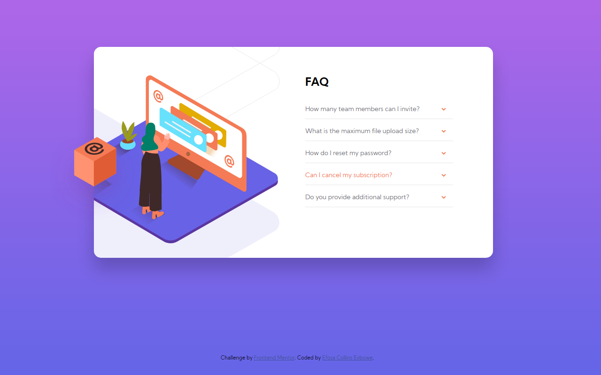
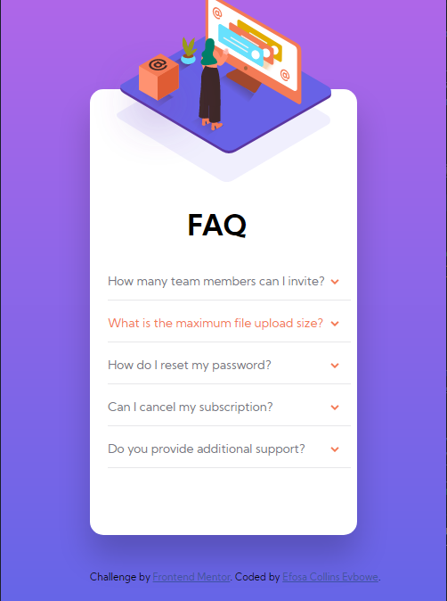

# Frontend Mentor - FAQ accordion card solution

This is a solution to the [FAQ accordion card challenge on Frontend Mentor](https://www.frontendmentor.io/challenges/faq-accordion-card-XlyjD0Oam). Frontend Mentor challenges help you improve your coding skills by building realistic projects. 

## Table of contents

- [Overview](#overview)
  - [The challenge](#the-challenge)
  - [Screenshot](#screenshot)
  - [Links](#links)
- [My process](#my-process)
  - [Built with](#built-with)
  - [What I learned](#what-i-learned)
  - [Continued development](#continued-development)
  - [Useful resources](#useful-resources)
- [Author](#author)

## Overview

### The challenge

Users should be able to:

- View the optimal layout for the component depending on their device's screen size
- See hover states for all interactive elements on the page
- Hide/Show the answer to a question when the question is clicked

### Screenshot

### Links

- Solution URL: [Solution to Challenge](https://www.frontendmentor.io/solutions/faq-accordion-using-sass-Au4OvrA7Q)
- Live Site URL: [Live Site](https://efecollins.github.io/faq/dist/)

## My process

### Built with

- Semantic HTML5 markup
- CSS custom properties
- Sass

### What I learned

Okay, here it is again, at first I thought the project was easy and I targeted finishing this within days but here I am completing this in weeks. 

There are a lot of things I have learnt now. Some of them are;
- Use sizes that are okay for your viewport.
- Although I don't like the idea. It's cool to build mobile first because there won't be much stress when checking your sizes again.

### Continued development

- CSS Flexbox
- CSS Grid
- JavaScript

### Useful resources

- [Flavio Copes](https://www.flaviocopes.com) - This helped me for Flexbox and Grids. I really liked this pattern and will use it going forward.

## Author

- Website - [Efosa Collins Evbowe](https://efecollins.github.io/new-pweb/dist)
- Frontend Mentor - [efecollins](https://www.frontendmentor.io/profile/efecollins)
- Twitter - [EfeCollins7](https://twitter.com/EfeCollins7)
